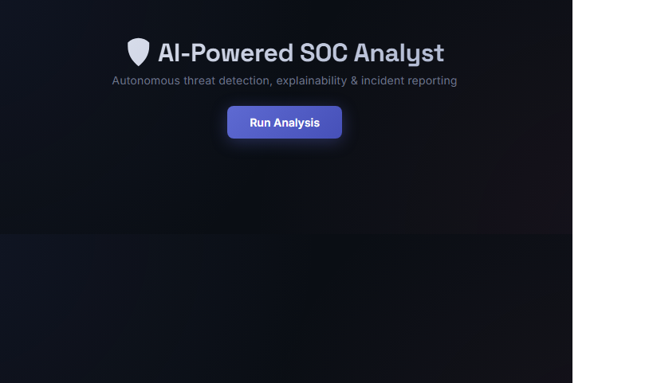
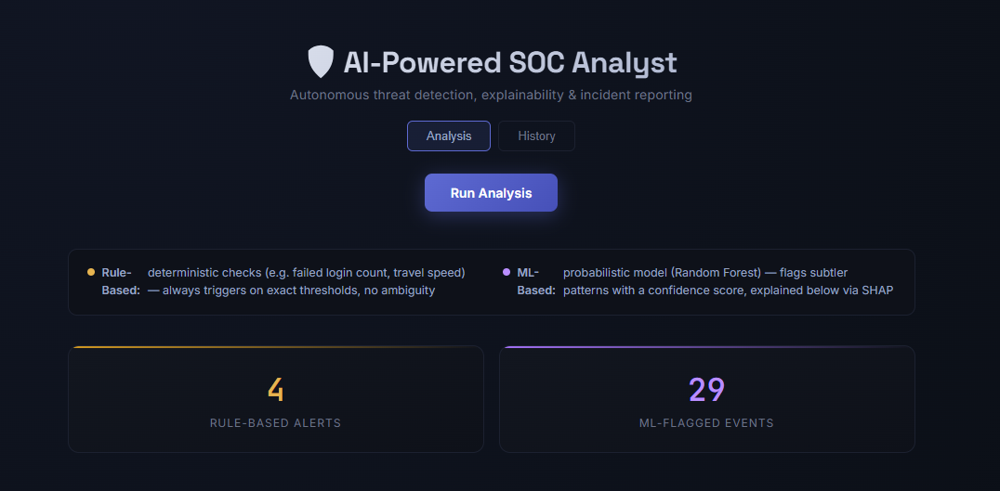
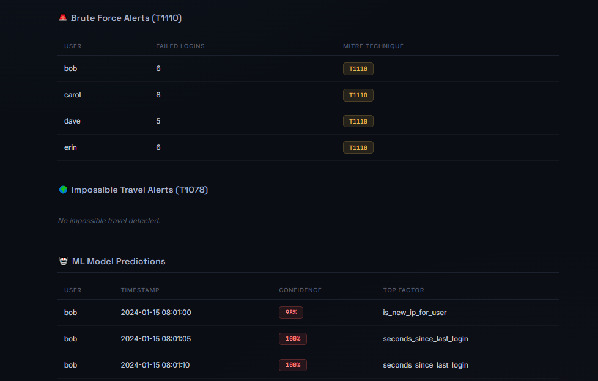

<div align="center">

# 🛡️ AI-Powered Autonomous SOC Analyst

**An end-to-end AI security platform that detects, explains, and reports on threats — autonomously.**

[](https://python.org)
[](https://flask.palletsprojects.com)
[](https://react.dev)
[](https://scikit-learn.org)
[](https://ai.google.dev)
[]()

[Live Demo]https://ai-soc-analyst-sigma.vercel.app/ · [API Health Check](https://ai-soc-analyst-8dx9.onrender.com/health) · [Report Bug](https://github.com/ishmeeeeet04/ai-soc-analyst/issues)

</div>

---

## 📖 Table of Contents

- [Overview](#-overview)
- [Live Demo](#-live-demo)
- [Architecture](#️-architecture)
- [Key Features](#-key-features)
- [Tech Stack](#-tech-stack)
- [Model Performance](#-model-performance)
- [Screenshots](#-screenshots)
- [Getting Started](#-getting-started)
- [Project Structure](#-project-structure)
- [Roadmap](#-roadmap)

---

## 🎯 Overview

Security Operations Centers are drowning in alerts. Analysts manually triage thousands of login events daily, most of them false positives — while real threats hide in the noise.

**This project builds an autonomous SOC analyst** that combines deterministic security rules with machine learning to detect attacks, explains *why* it flagged something using SHAP, maps every detection to the industry-standard **MITRE ATT&CK** framework, and writes a human-readable incident report using a **RAG-grounded LLM** — the same architecture pattern used by tools like Microsoft Copilot for Security and CrowdStrike Charlotte AI.

## 🔗 Live Demo

| Service | Link |
|---|---|
| 🖥️ Dashboard | [ai-soc-analyst-sigma.vercel.app](https://ai-soc-analyst-sigma.vercel.app/) |
| ⚙️ API | [ai-soc-analyst-8dx9.onrender.com](https://ai-soc-analyst-8dx9.onrender.com/health) |

> ⏱️ Hosted on free-tier infrastructure — the first request may take 30–60s while the server wakes up.

## 🏗️ Architecture
┌─────────────┐      ┌──────────────────┐      ┌─────────────────┐
│  Raw Logs   │─────▶│  Rule-Based       │─────▶│                  │
│  (CSV)      │      │  Detection        │      │                  │
└─────────────┘      │  • Brute Force    │      │   Flask REST     │
│  • Impossible     │─────▶│   API            │
┌─────────────┐      │    Travel         │      │                  │
│  Feature    │─────▶└──────────────────┘      │                  │
│  Engineering│                                  │                  │
└─────────────┘      ┌──────────────────┐      │                  │
│  ML Model         │─────▶│                  │
│  (Random Forest)  │      └────────┬─────────┘
│  + SHAP           │               │
└──────────────────┘               ▼
┌─────────────────────┐
┌──────────────────┐    │  RAG-Grounded LLM   │
│  MITRE ATT&CK    │───▶│  Incident Summary   │
│  Mapping         │    │  (Gemini + ChromaDB)│
└──────────────────┘    └──────────┬──────────┘
▼
┌─────────────────────┐
│  React Dashboard    │
└─────────────────────┘
## ✨ Key Features

- 🔍 **Hybrid Detection Engine** — rule-based logic for known patterns (brute force, impossible travel) combined with a Random Forest ML model for subtler anomalies
- 🧠 **Explainable AI** — every ML prediction comes with SHAP-based feature attribution, showing exactly *why* an event was flagged
- 🌍 **Real Geolocation** — impossible-travel detection uses live IP geolocation and the Haversine formula to calculate real-world required travel speed
- 🗺️ **MITRE ATT&CK Mapping** — every detection is tagged with its official technique ID (T1110, T1078) and tactic
- 📝 **AI-Generated Incident Reports** — a RAG pipeline retrieves relevant MITRE guidance and past-incident learnings, grounding the LLM's summary in real reference material instead of hallucinated advice
- 📊 **Live Dashboard** — React frontend visualizing alerts, confidence scores, and AI-generated reports in real time

## 🧰 Tech Stack

**Backend:** Python · Flask · Gunicorn
**ML/AI:** scikit-learn · SHAP · pandas · ChromaDB · Google Gemini API
**Frontend:** React · Vite
**Infra:** Render (API) · Vercel (Dashboard) · GitHub Actions-ready

## 📊 Model Performance

Trained on synthetic, labeled log data with injected attack patterns:

| Metric | Score |
|---|---|
| Precision (Attack class) | 0.89 |
| Recall (Attack class) | 0.89 |
| F1-score | 0.89 |
| Accuracy | 0.93 |

## 📸 Screenshots

<div align="center">

### Dashboard Overview


### Analysis Results — AI-Generated Incident Report


### MITRE ATT&CK Mapped Alerts


</div>

## 🚀 Getting Started

```bash
# Clone
git clone https://github.com/ishmeeeeet04/ai-soc-analyst.git
cd ai-soc-analyst

# Backend
python -m venv venv
.\venv\Scripts\Activate.ps1
pip install -r requirements.txt
python -m src.api.app

# Frontend (new terminal)
cd frontend
npm install
npm run dev
```

Full setup guide: [`/docs`](./docs)

## 📁 Project Structure
ai-soc-analyst/
├── src/
│   ├── ingestion/       # Log loading & synthetic data generation
│   ├── detections/      # Rule-based detection engines
│   ├── preprocessing/   # Feature engineering
│   ├── ml/              # Model training, prediction, SHAP explainability
│   ├── llm/             # RAG pipeline & incident summarization
│   └── api/             # Flask REST API
├── frontend/             # React dashboard
├── models/               # Trained model artifacts
└── tests/                 # Automated test suite

## 🗺️ Roadmap

- [ ] User authentication
- [ ] File upload for custom log analysis
- [ ] Real-time streaming detection
- [ ] Multi-model comparison (XGBoost, Isolation Forest)

---

<div align="center">
Built as a Final Year Project · <a href="https://github.com/ishmeeeeet04">@ishmeeeeet04</a>
</div>
